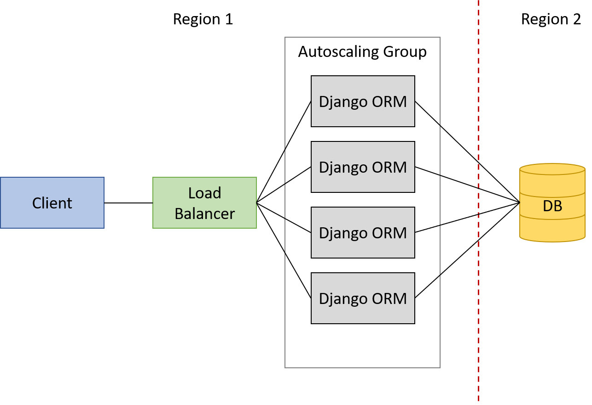

## Multicloud ORM System with Load Balancer and Autoscaling

This project uses boto3, Django and Postgres to programatically build a multicloud ORM system that works with Load Balancer and Autoscaling. After the build is complete the system should have the following architecture:



As the ORM is served with an Autoscaling Group and a Load Balancer the system ends up getting more resilience and scalability. Therefore, the system is able to deal with a surge of requests as the Load Balancer makes sure that those requests are not overwhelming a single instance. The Autoscaling Group increases or decreases the number of instances according to demand. The system's flexibility to grow or shrink as needed, helps to maximize availability, while minimizing resource idleness. 

In this specific project, the regions used were North Virginia (us-east-1) for the ORM application and Ohio (us-east-2) for the database.

To get the system up and running, only one bash script named buildCloud needs to be run. It automatically builds the whole system in the following steps:

1. Setup the database instance security group
2. Launch and configure the database instance
3. Setup the ORM application instance security group
4. Launch and configure a template instance for the AutoScaling Group
5. Create Load Balancer
6. Create Autoscaling Group
7. Delete template instance

Additionally, it's able to identify if either the database is already setup or the ORM application instance is already running. When any of these two scenarios happen, it asks the user whether it should terminate that part of the system and launch it again or if it should just let it keep running with no changes.

In order to shut down the whole system, it's enough to run the terminateCloud bash script, which identifies when the system is running and shut it down.

To complete the package, the project also comes with a simple CLI that allows the user to interact with the application through bash commands. The python script responsible for that is called "client.py". The following example shows which arguments should be passed for the script to work:

```sh
>>> python3 client.py -h

usage: client.py [-h] [--id ID] [--title TITLE] [--desc DESC] {GET,POST,PUT,DELETE}

positional arguments:
  {GET,POST,PUT,DELETE}
                        HTTP verb of the request

optional arguments:
  -h, --help            show this help message and exit
  --id ID               Task ID
  --title TITLE         Task title
  --desc DESC           Task description
```
